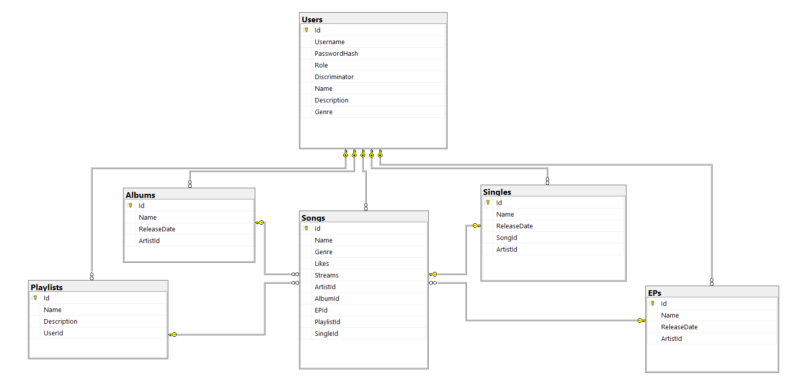
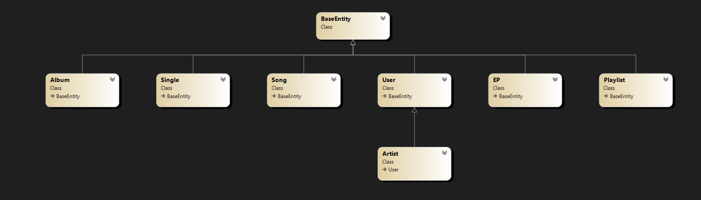

#                        Documentația proiectului 

#                                Music Platform 

Link: https://github.com/tudorp9k/MusicPlatform.git

​                                                                                                                                                                Studenti:

​                                                                                                                                                                Popa Tudor - Grupa 10LF213

​                                                                                                                                                                Pavel Codrut - Grupa 10LF212

## Prezentarea proiectului, ce isi propune, ce probleme rezolva

Music Platform este o platformă online inovatoare care oferă utilizatorilor acces la o bibliotecă extinsă de melodii și funcționalități personalizate pentru a se bucura de muzică într-un mod unic și interactiv. Această platformă are drept scop să rezolve problemele și să îndeplinească nevoile pasionaților de muzică, oferindu-le o experiență completă și captivantă în domeniul muzical.

Music Platform pune accent pe interactivitate și personalizare. Utilizatorii pot crea liste de redare personalizate, pot marca melodiile favorite, pot urmări artiști și pot primi actualizări despre noile lansări și evenimente ale acestora. Prin intermediul funcției de statistici de ascultare, utilizatorii pot obține informații detaliate despre preferințele lor muzicale, numărul de redări și poate chiar să descopere statistici interesante despre artistul lor preferat.

Music Platform oferă, de asemenea, o comunitate vibrantă și interacțiune socială. Utilizatorii pot interacționa cu alți iubitori de muzică prin partajarea listelor de redare. Aceasta creează un spațiu pentru descoperire și conectare între oameni cu gusturi muzicale similare și deschide porți către noi prietenii și colaborări în industria muzicală.

Music Platform reprezintă un instrument esențial pentru artiști, oferindu-le posibilitatea de a-și crește expunerea și de a construi conexiuni autentice cu fanii lor. Este un ecosistem digital care pune în prim-plan talentele și pasiunea artiștilor, deschizând noi uși către succesul în industria muzicală contemporană.

Prin integrarea tuturor acestor caracteristici, Music Platform rezolvă problemele de accesibilitate și descoperire în lumea muzicii, oferind utilizatorilor o experiență completă și satisfăcătoare. Indiferent dacă sunt în căutarea noilor lor artisti preferati sau doresc să exploreze și să descopere genuri muzicale noi, Music Platform îi încurajează pe utilizatori să-și exprime pasiunea pentru muzică și să-și creeze propria lor experiență muzicală captivantă.

## Tehnologiile utilizate

- EntityFrameworkCore: Această tehnologie este o parte integrantă a framework-ului .NET Core și este utilizată pentru gestionarea și interacțiunea cu baza de date. Prin intermediul bibliotecii Entity Framework Core, sunt create și gestionate migrăriile bazei de date, permitând actualizări ale schemei și manipularea datelor. Utilizarea migrărilor în cadrul proiectului permite gestionarea versiunilor bazei de date și aplicarea modificărilor în mod corespunzător. Migrările sunt utilizate pentru a adăuga, actualiza sau șterge tabele, coloane și constrângeri din schema bazei de date. Prin intermediul bibliotecii Entity Framework Core, este realizat un mapping între modelele obiect-entitate și structura tabelelor din baza de date. Aceasta facilitează interacțiunea cu baza de date prin intermediul obiectelor și metodelor specifice. Sunt utilizate constrângerile de chei străine pentru a asigura integritatea referențială între tabelele bazei de date. Aceste constrângeri permit asocierea corespunzătoare între entități și facilitează navigarea între ele.

- SQL Server: Baza de date utilizată în cadrul proiectului este SQL Server, un sistem de gestionare a bazelor de date relaționale. Acesta oferă funcționalități puternice pentru stocarea și manipularea datelor muzicale, asigurând performanță și scalabilitate. Acesta este utilizat în proiectul Music Platform pentru a stoca și gestiona datele referitoare la artiști, albume, melodii, playlist-uri și alte informații relevante pentru platformă. Prin utilizarea SQL Server se asigură o gestionare eficientă a datelor și securitate avansată, contribuind la o experiență de utilizare optimă pentru artiști și utilizatori ai platformei.

- ASP.NET: Au fost create endpoint-uri API care permit comunicarea și schimbul de date între client și server. API-ul oferă funcționalități diverse pentru a sprijini operațiuni precum înregistrarea și autentificarea utilizatorilor, gestionarea profilurilor și interacțiunea cu resursele muzicale. ASP.NET utilizează un sistem de rute flexibil, care permite definirea și gestionarea rutelor URL pentru fiecare endpoint al API-ului. Acest lucru facilitează accesul și navigarea către diferitele funcționalități și resurse ale platformei. API-ul este structurat în jurul conceptului de controlere, care gestionează cererile primite de la client și returnează răspunsurile corespunzătoare. Controlerele ASP.NET oferă metode și acțiuni pentru a procesa cererile HTTP și pentru a interacționa cu serviciile și baza de date.

  

  

## Backend, Request-uri folosite

Una dintre componentele cheie ale backend-ului este API-ul (Application Programming Interface), care permite comunicarea între frontend (interfața utilizator) și backend (serverul). API-ul este construit folosind framework-ul ASP.NET, care oferă un mediu robust pentru dezvoltarea aplicațiilor web. 

Prin intermediul API-ului, utilizatorii pot face diferite tipuri de request-uri către server pentru a accesa și manipula datele de pe platformă. Iată câteva tipuri de request-uri folosite în Music Platform:

1. GET request: Acest tip de request este utilizat pentru a obține informații despre artisti, albume, melodii, playlist-uri sau alte entități de pe platformă. De exemplu, un GET request către ruta /artists poate returna o listă cu toți artiștii înregistrați în sistem.

2. POST request: Acest tip de request este utilizat pentru a crea noi înregistrări în baza de date. De exemplu, un POST request către ruta /songs poate fi folosit pentru a adăuga o nouă melodie în sistem, specificând detaliile acesteia, cum ar fi numele, artistul și albumul asociat.

3. PATCH request: Acest tip de request este utilizat pentru a actualiza parțial o resursă existentă în baza de date. Spre deosebire de PUT request, care înlocuiește întreaga resursă, PATCH request permite actualizarea selectivă a anumitor câmpuri ale resursei fără a afecta restul datelor. Acest lucru se realizează prin trimiterea unui set de instrucțiuni sau operații care descriu modificările dorite.

4. DELETE request: Acest tip de request este utilizat pentru a șterge înregistrări din baza de date. De exemplu, un DELETE request către ruta /songs/{id} poate fi folosit pentru a șterge o melodie existentă din sistem, identificată prin ID-ul său.

În plus, backend-ul Music Platform utilizează diverse biblioteci și componente C# pentru a gestiona autentificarea utilizatorilor, validarea datelor, gestionarea erorilor și multe altele. De exemplu, se poate folosi biblioteca Entity Framework pentru a realiza maparea obiect-relațională (ORM) și pentru a interacționa cu baza de date SQL Server.

Prin intermediul acestor request-uri și a funcționalităților backend-ului, artistii pot adăuga, actualiza și șterge melodiile, pot crea și administra albume și playlist-uri, pot interacționa cu fanii și pot beneficia de funcționalități specifice precum statistici despre audiență, gestionarea drepturilor de autor și multe altele. Backend-ul oferă o interfață eficientă și sigură pentru ca artiștii să-și gestioneze conținutul și să interacționeze cu utilizatorii pe platforma Music Platform.

## Arhitectura

Arhitectura platformei Music Platform a fost concepută cu atenție pentru a asigura o separare clară între diferitele componente și a facilita scalabilitatea, extensibilitatea și întreținerea sistemului. Arhitectura urmează un design pattern bazat pe conceptul de Repository - Service - Controller și este împărțită în trei niveluri principale: Data Logic, Business Logic și API.

Nivelul de Data Logic reprezintă baza de date și interacțiunea cu aceasta. Pentru a gestiona operațiunile de bază, cum ar fi stocarea, actualizarea și interogarea datelor, este utilizată o bază de date relațională, cum ar fi SQL Server. În această arhitectură, se utilizează un design pattern numit Repository, care separă operațiunile specifice bazei de date de restul aplicației. Astfel, există clase de tip Repository care se ocupă de accesul la date și de executarea operațiunilor CRUD (Create, Read, Update, Delete) asupra acestora.

Nivelul de Business Logic reprezintă logica de afaceri a platformei. Aici sunt implementate regulile de validare, procesele complexe și operațiunile specifice domeniului muzical. Acest nivel este responsabil pentru prelucrarea datelor, aplicarea logicii de afaceri și asigurarea coerenței și integrității datelor. În arhitectura Music Platform, nivelul de Business Logic este implementat utilizând servicii (Services). Serviciile reprezintă componente independente care se ocupă de logica de afaceri și interacționează cu nivelul de Data Logic prin intermediul repository-urilor. Ele encapsulează funcționalitățile specifice și expun metode prin care pot fi apelate și utilizate în alte părți ale aplicației.

Nivelul de API reprezintă interfața prin care utilizatorii interacționează cu platforma. Aici sunt definite rutele, controlerele și acțiunile care răspund la cererile utilizatorilor și furnizează datele sau execută operațiunile solicitate. Controlerele reprezintă punctele de intrare în aplicație și gestionează interacțiunea cu nivelul de Business Logic prin intermediul serviciilor. Ele preiau cererile HTTP, validează datele primite, apelează serviciile corespunzătoare și returnează răspunsurile către utilizatori. În arhitectura Music Platform, API-ul este construit folosind framework-ul ASP.NET și utilizează conceptul de routing pentru a direcționa cererile către controlerele corespunzătoare.

Această arhitectură împărțită în trei niveluri - Data Logic, Business Logic și API - oferă multiple beneficii. Separarea logică a funcționalităților permite dezvoltarea modulară și independentă a componentelor, facilitând testarea și întreținerea. De asemenea, permite scalabilitatea sistemului, deoarece fiecare nivel poate fi gestionat și dimensionat separat. Util

izarea design pattern-ului Repository - Service - Controller asigură o structură clară și o organizare eficientă a codului, facilitând colaborarea între dezvoltatori și dezvoltarea ulterioară a platformei.

Navigarea în cadrul platformei Music Platform este gestionată prin intermediul rutelor și acțiunilor definite în controlerele API-ului. Utilizatorii pot accesa diferite resurse, cum ar fi artiști, albume, melodii sau playlist-uri, prin intermediul cererilor HTTP și al parametrilor specifici. De exemplu, o cerere GET către ruta /artists poate returna o listă cu toți artiștii înregistrați, în timp ce o cerere GET către ruta /songs/{id} poate returna detaliile unei melodii specifice, identificate prin ID-ul său.

În concluzie, arhitectura platformei Music Platform, bazată pe design pattern-ul Repository - Service - Controller și împărțită în trei niveluri (Data Logic, Business Logic și API), permite o dezvoltare modulară, scalabilă și ușor de întreținut. Prin separarea logică a componentelor și utilizarea tehnologiilor precum SQL Server, ASP.NET și C#, se asigură o gestionare eficientă a datelor, o logica de afaceri coerentă și o interfață prietenoasă pentru utilizatori.

## Utilizabilitatea aplicatiei

Platforma Music Platform este concepută pentru a oferi o experiență personalizată și specifică pentru fiecare tip de utilizator. Aceasta are trei tipuri de utilizatori: Admin, Artist și User. Fiecare tip de utilizator are anumite privilegii și restricții în funcție de rolul său în cadrul aplicației.

1. Admin:
   - Adminul este utilizatorul cu cele mai mari privilegii și acces nelimitat la toate funcționalitățile platformei.
   - Poate adăuga, edita și șterge artiști, albume, melodii și playlist-uri.
   - Are dreptul de a gestiona conturile utilizatorilor, inclusiv crearea, modificarea și ștergerea acestora.
   - Are puterea de a aproba sau respinge cererile de înscriere ale artiștilor noi.
   - Poate gestiona permisiunile și rolurile utilizatorilor, inclusiv alocarea rolului de Artist sau User.

2. Artist:
   - Artistul este utilizatorul care își promovează și își gestionează propriile creații muzicale pe platformă.
   - Are dreptul de a adăuga, edita și șterge propriile melodii și albume.
   - Poate vizualiza și gestiona detaliile personale, inclusiv informații despre profil și contul său.
   - Nu are acces la funcționalitățile de administrare a altor utilizatori sau a altor artiști.
   - Are posibilitatea de a vedea statistici și rapoarte privind performanța melodiilor și albumelor sale.

3. User:
   - Userul este utilizatorul obișnuit al platformei, care explorează și ascultă muzica oferită de artiști.
   - Poate crea și gestiona propriile playlist-uri, adăugând și eliminând melodii.
   - Are acces la funcționalitățile de căutare, redare și urmărire a artiștilor preferați.
   - Poate vedea detalii despre albumele și melodiile disponibile pe platformă, dar nu poate modifica sau șterge conținutul creat de alți utilizatori sau artiști.

Pentru a asigura securitatea și confidențialitatea datelor, platforma Music Platform implementează un sistem de autentificare și autorizare. Utilizatorii trebuie să se autentifice înainte de a avea acces la funcționalitățile platformei. Autentificarea se realizează prin intermediul unui sistem de autentificare bazat pe roluri, unde fiecare utilizator are un set specific de permisiuni în funcție de rolul său.

Adminul are acces nelimitat și nu este restricționat de nicio autorizare specifică. Artistul poate accesa doar funcționalitățile legate de gestionarea propriilor creații muzicale, iar Userul poate accesa doar funcționalitățile de căutare, redare și gestionare a propriilor playlist-uri.

Prin această abordare, Music Platform oferă o experiență personalizată și adaptată

 nevoilor fiecărui tip de utilizator, asigurând în același timp securitatea și protecția datelor. Utilizatorii pot explora și se pot bucura de muzica preferată, artiștii își pot promova creațiile, iar adminul poate gestiona și monitoriza întreaga platformă.

## Concluzie

În concluzie, proiectul Music Platform reprezintă o platformă complexă și captivantă, concepută pentru a aduce împreună artiști și iubitori ai muzicii. Acest proiect are ca scop principal facilitarea și îmbunătățirea experienței utilizatorilor în ceea ce privește descoperirea, ascultarea și promovarea muzicii.

Prin intermediul arhitecturii bine definită și a utilizării tehnologiilor moderne, Music Platform oferă o gamă largă de funcționalități și caracteristici adaptate nevoilor diferitelor tipuri de utilizatori. Designul modular și structurat, cu componente precum Repository, Service și Controller, permite o dezvoltare flexibilă și ușurință în gestionarea datelor.

Utilizatorii platformei se bucură de o interfață intuitivă și prietenoasă, care facilitează navigarea, căutarea și redarea melodiilor preferate. Artistul beneficiază de instrumente puternice pentru a-și gestiona și promova creațiile muzicale, în timp ce adminul are acces total și controlează funcționalitățile și permisiunile întregii platforme.

De asemenea, securitatea datelor și protecția informațiilor personale sunt aspecte esențiale în acest proiect. Implementarea autentificării și autorizării asigură că doar utilizatorii autorizați au acces la funcționalitățile specifice rolului lor.

Prin intermediul integrării cu o bază de date robustă și scalabilă, cum ar fi SQL Server, se realizează o gestionare eficientă și fiabilă a datelor, asigurându-se performanța și disponibilitatea în timp real a informațiilor.

În ansamblu, proiectul Music Platform demonstrează o abordare profesională și meticuloasă în dezvoltarea unei platforme de muzică modernă. Aceasta reușește să aducă împreună artiști și iubitori ai muzicii, oferind o experiență captivantă, personalizată și sigură pentru toți utilizatorii. Prin intermediul tehnologiilor de ultimă generație și a unei arhitecturi bine construite, Music Platform se poziționează ca o soluție inovatoare și de încredere în industria muzicală digitală.
