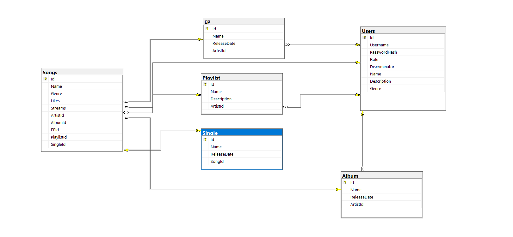

# Documentație pentru proiectul  "Music Platform"

Proiectul "Music Platform" este o aplicație dezvoltată în limbajul C# care oferă o platformă interactivă pentru ascultarea și descoperirea de muzică. Scopul acestui proiect este de a crea un mediu prietenos și accesibil pentru utilizatori, unde aceștia pot explora și asculta diverse genuri muzicale, să descopere artiști noi și să interacționeze cu comunitatea muzicală.


## Capitolul 1: Arhitectura bazei de date

Baza de date pentru platforma muzicală va fi compusă din următoarele tabele:

a) Tabela "Users" - va conține informații despre utilizatori și câmpurile sale:

   - Id (cheie primară, tip: int) - identificator unic pentru fiecare utilizator
   - Username (tip: varchar) - numele utilizatorului
   - PasswordHash (tip: varchar) - valoarea hash a parolei utilizatorului
   - Role (tip: varchar) - rolul utilizatorului (ex: "admin", "user")

b) Tabela "Songs" - va conține informații despre cântece și câmpurile sale:

   - Id (cheie primară, tip: int) - identificator unic pentru fiecare cântec
   - Name (tip: varchar) - numele cântecului
   - Genre (tip: enum) - genul muzical al cântecului
   - Likes (tip: int) - numărul de aprecieri pentru cântec
   - Streams (tip: int) - numărul de ascultări pentru cântec
   - ArtistId (tip: int) - identificatorul artistului asociat acestui cântec (cheie externă către tabela "Artists")

c) Tabela "Artists" - va conține informații despre artiști și câmpurile sale:

   - Id (cheie primară, tip: int) - identificator unic pentru fiecare artist

   - Name (tip: varchar) - numele artistului

   - Description (tip: varchar) - descrierea artistului

   - Genre (tip: enum) - genul muzical al artistului

Legătura între tabele:

- Tabela "Artists" și "Songs" au o relație de tip one-to-many, unde un artist poate avea mai multe cântece asociate.

Constrângerile la ștergere:

- Dacă un artist este șters din tabela "Artists", toate cântecele asociate acestuia din tabela "Songs" vor fi șterse în mod automat (constrângere de tip "CASCADE").

- Migrarea este definită prin clasa `Updated_DB_Schema` care moștenește clasa `Migration` din namespace-ul `Microsoft.EntityFrameworkCore.Migrations`. Aceasta conține două metode suprascrise: `Up` și `Down`.

  Metoda `Up` este responsabilă pentru efectuarea modificărilor în baza de date atunci când migrarea este aplicată. În acest caz, metoda adaugă patru coloane noi în tabela "Songs" și creează patru tabele noi: "Album", "EP", "Playlist" și "Single". De asemenea, se definesc chei primare și constrângeri de cheie externă pentru aceste tabele folosind metodele disponibile în clasa `MigrationBuilder`.

  Metoda `Down` este responsabilă pentru revenirea modificărilor făcute în metoda `Up` în cazul în care migrarea este anulată sau revertată. În acest caz, se elimină coloanele și tabelele create în metoda `Up`.

  Astfel, această migrare adaugă coloane noi în tabela "Songs" și creează patru tabele noi în baza de date, reprezentând entități precum albume, EP-uri, playlist-uri și single-uri. De asemenea, sunt definite relațiile dintre aceste entități și tabela "Songs" prin intermediul constrângerilor de cheie externă (foreign key constraints). Aceste modificări au rolul de a actualiza schema bazei de date pentru a reflecta aceste entități și relații în cadrul aplicației.

Tipurile de date alese pentru fiecare câmp al tabelelor:

- Id, ArtistId vor fi de tip întreg (int)

- Username, PasswordHash, Name, Description vor fi de tip text (varchar)

- Genre va fi de tip enum, reprezentând genul muzical (ex: Rock, Pop, Jazz)

  

  

  

  

  

## Capitolul 2: Implementarea autentificării și autorizării

Pentru implementarea autentificării și autorizării în cadrul proiectului "Music Platform" s-au creat clasele `AuthorizationService` și `AuthenticationService` cu funcționalități specifice.

Clasa `AuthorizationService` este responsabilă de generarea și validarea token-urilor JWT (JSON Web Token). Aceasta utilizează o cheie de securitate (`_securityKey`) pentru generarea semnăturii token-urilor. Metodele principale ale clasei includ:

- `GetToken(User user)`: Această metodă primește un obiect de tip `User` și generează un token JWT. Token-ul conține informații despre rolul utilizatorului, ID-ul utilizatorului și numele de utilizator. Token-ul este semnat cu ajutorul cheii de securitate și are o perioadă de valabilitate de 1 an.

- `ValidateToken(string tokenString)`: Această metodă primește un șir de caractere reprezentând un token JWT și verifică validitatea acestuia. Metoda validează semnătura token-ului și asigură că token-ul nu a expirat.

- `HashPassword(string password)`: Această metodă primește o parolă în clar și returnează valoarea hash a parolei. Metoda utilizează un algoritm PBKDF2 pentru a genera un hash securizat al parolei.

- `VerifyHashedPassword(string hashedPassword, string password)`: Această metodă primește un hash al parolei și o parolă în clar și verifică dacă parola în clar se potrivește cu hash-ul stocat.

  

Clasa `AuthenticationService` utilizează serviciul `AuthorizationService` pentru a implementa funcționalitatea de înregistrare a utilizatorilor și artiștilor în aplicație. Metodele principale ale clasei includ:

- `Register(UserDto registerData)`: Această metodă primește datele de înregistrare ale unui utilizator și înregistrează un nou utilizator în baza de date. Parola utilizatorului este hash-uită folosind serviciul `AuthorizationService` înainte de a fi salvată.

- `Register(ArtistDto registerData)`: Această metodă primește datele de înregistrare ale unui artist și înregistrează un nou artist în baza de date. Parola artistului este hash-uită folosind serviciul `AuthorizationService` înainte de a fi salvată.

- `Validate(UserDto payload)`: Această metodă primește datele de autentificare ale unui utilizator și verifică validitatea acestora. Metoda verifică dacă utilizatorul este un artist sau un utilizator obișnuit și apoi validează parola. Dacă datele sunt valide, metoda returnează un token JWT generat folosind serviciul `AuthorizationService`.

  

Aceste clase și metodele asociate sunt utilizate în implementarea funcționalității de autentificare și autorizare în cadrul aplicației "Music Platform". Detaliile specifice și utilizarea acestor clase și metode vor depinde de arhitectura și fluxul de lucru al aplicației.


## Capitolul 3: Implementarea comunicării server-bază de date folosind ORM-ul Entity Framework Core

Implementarea comunicării server-bază de date în cadrul proiectului "Music Platform" se realizează utilizând ORM-ul (Object-Relational Mapping) Entity Framework Core. Clasa `MusicDbContextModelSnapshot` din namespace-ul `MusicPlatform.DataLayer.Migrations` reprezintă o înregistrare a modelului bazei de date și descrie entitățile, proprietățile și relațiile dintre acestea.

Metoda `BuildModel(ModelBuilder modelBuilder)` este responsabilă de construirea modelului bazei de date utilizând obiectul `modelBuilder`. Aici sunt definite entitățile și proprietățile acestora, precum și constrângerile asociate. Mai jos este prezentată implementarea acestei metode, în conformitate cu structurile modelelor din proiect:

```csharp
modelBuilder.Entity("MusicPlatform.DataLayer.Models.Song", b =>
{
    b.Property<int>("Id")
        .ValueGeneratedOnAdd()
        .HasColumnType("int");

    b.Property<int>("ArtistId")
        .HasColumnType("int");

    b.Property<int>("Genre")
        .HasColumnType("int");

    b.Property<int>("Likes")
        .HasColumnType("int");

    b.Property<string>("Name")
        .IsRequired()
        .HasColumnType("nvarchar(max)");

    b.Property<int>("Streams")
        .HasColumnType("int");

    b.HasKey("Id");

    b.HasIndex("ArtistId");

    b.ToTable("Songs");
});

modelBuilder.Entity("MusicPlatform.DataLayer.Models.User", b =>
{
    b.Property<int>("Id")
        .ValueGeneratedOnAdd()
        .HasColumnType("int");

    b.Property<string>("Discriminator")
        .IsRequired()
        .HasColumnType("nvarchar(max)");

    b.Property<string>("PasswordHash")
        .IsRequired()
        .HasColumnType("nvarchar(max)");

    b.Property<string>("Role")
        .IsRequired()
        .HasColumnType("nvarchar(max)");

    b.Property<string>("Username")
        .IsRequired()
        .HasColumnType("nvarchar(max)");

    b.HasKey("Id");

    b.ToTable("Users");

    b.HasDiscriminator<string>("Discriminator").HasValue("User");

    b.UseTphMappingStrategy();
});

modelBuilder.Entity("MusicPlatform.DataLayer.Models.Artist", b =>
{
    b.HasBaseType("MusicPlatform.DataLayer.Models.User");

    b.Property<string>("Description")
        .IsRequired()
        .HasColumnType("nvarchar(max)");

    b.Property<int>("Genre")
        .HasColumnType("int");

    b.Property<string>("Name")
        .IsRequired()
        .HasColumnType("nvarchar(max)");

    b.HasDiscriminator().HasValue("Artist");
});

modelBuilder.Entity("MusicPlatform.DataLayer.Models.Song", b =>
{
    b.HasOne("MusicPlatform.DataLayer.Models.Artist", "Artist")
        .WithMany("Songs")
        .HasForeignKey("ArtistId")
        .OnDelete(DeleteBehavior.Cascade)
        .IsRequired();

    b.Navigation("Artist");
});

modelBuilder.Entity("MusicPlatform.DataLayer.Models.Artist", b =>
{
    b.Navigation("Songs");
});
```

Această implementare configurează corect tabelele și relațiile dintre acestea în baza de date. Sunt definite tabelele "Songs" și "Users", precum și relația dintre acestea prin cheia străină "ArtistId" din tabela "Songs". De asemenea, este definită relația de moștenire între clasa `Artist` și clasa `User`, utilizând `Has

BaseType` și `HasDiscriminator`. Proprietățile și tipurile de date sunt specificate corespunzător pentru fiecare câmp al tabelelor.

Este important să menționăm că această implementare a modelului bazei de date este generată automat de către Entity Framework Core pe baza structurii claselor de entități și a relațiilor definite între acestea.

Cu această implementare a comunicării server-bază de date, aplicația "Music Platform" beneficiază de toate avantajele oferite de Entity Framework Core, precum gestionarea simplificată a entităților, relațiilor și operațiilor CRUD, precum și abstracția de la detalii specifice bazei de date subiacente.


## Capitolul 4: Implementarea controllerelor API în proiectul "Music Platform"

Implementarea controllerelor API în cadrul proiectului "Music Platform" se face prin intermediul claselor din namespace-ul MusicPlatformAPI.Controllers. Aceste clase definesc rutele, acțiunile și logica asociată fiecărei rute API.
Clasa AccountController gestionează acțiunile legate de autentificare și înregistrare a utilizatorilor și artiștilor. Rutele definite sunt /api/account/register/user, /api/account/register/artist și /api/account/login. Metoda RegisterUser se ocupă de înregistrarea unui utilizator, RegisterArtist se ocupă de înregistrarea unui artist, iar Login gestionează procesul de autentificare.
Clasa ArtistController gestionează acțiunile legate de artiști. Rutele definite sunt /api/artist/get-all, /api/artist/get/{artistId}, /api/artist/edit și /api/artist/delete. Metodele GetAll și Get returnează toți artiștii sau un artist specific în funcție de ID-ul artistului, respectiv. Metodele Edit și Delete permit actualizarea și ștergerea unui artist în funcție de ID-ul acestuia. Aceste două acțiuni necesită autorizarea utilizatorului, înrolat ca "Admin" sau "Artist".

Clasa SongController gestionează acțiunile legate de cântece. Rutele definite sunt /api/song/get-all, /api/song/get/{songId}, /api/song/add, /api/song/edit și /api/song/delete. Metodele GetAll și Get returnează toate cântecele sau un cântec specific în funcție de ID-ul acestuia. Metoda Add permite adăugarea unui cântec nou, cu condiția ca utilizatorul autentificat să fie un "Admin" sau "Artist" și să fie proprietarul cântecului. Metoda Edit permite actualizarea unui cântec existent în funcție de ID-ul acestuia și proprietarul să fie "Admin" sau "Artist". Metoda Delete permite ștergerea unui cântec în funcție de ID-ul acestuia și proprietarul să fie "Admin" sau "Artist".

Acestea sunt implementările de bază ale controllerelor API în cadrul proiectului "Music Platform". Acestea oferă funcționalități esențiale pentru gestionarea utilizatorilor, artiștilor și cântecelor prin intermediul aplicației web.

```csharp
public class SongNotFoundExceptionFilter : ExceptionFilterAttribute
{
    public override void OnException(ExceptionContext context)
    {
        if (context.Exception is SongNotFoundException)
        {
            var result = new ObjectResult(context.Exception.Message)
            {
                StatusCode = 404
            };

            context.Result = result;
            context.ExceptionHandled = true;
        }

        base.OnException(context);
    }
}
```

Acest cod definesc o clasă denumită `SongNotFoundExceptionFilter` care moștenește clasa `ExceptionFilterAttribute`, utilizată în framework-ul ASP.NET pentru a manipula excepțiile.

În metoda suprascrisă `OnException`, se verifică dacă excepția aruncată este de tipul `SongNotFoundException` prin intermediul construcției `if (context.Exception is SongNotFoundException)`. Dacă condiția este îndeplinită, se creează un nou obiect `ObjectResult`, care conține mesajul de eroare al excepției, și se atribuie codul de stare HTTP 404 (`StatusCode = 404`).

Apoi, se setează rezultatul obținut ca rezultat al contextului excepției prin intermediul proprietății `context.Result`. De asemenea, se marchează excepția ca fiind tratată prin setarea proprietății `context.ExceptionHandled` la `true`.

La final, se apelează metoda `OnException` a clasei de bază (`base.OnException(context)`) pentru a menține comportamentul implicit al gestionării excepțiilor.

Astfel, prin utilizarea acestui filtru în cadrul unei aplicații ASP.NET, se poate intercepta excepția `SongNotFoundException` și se poate returna un răspuns HTTP cu codul de stare 404 și mesajul de eroare asociat.


## Capitolul 5) Tratarea excepțiilor

Pentru tratarea excepțiilor în cadrul aplicației, se poate folosi mecanismul de gestionare a excepțiilor oferit de C# și ASP.NET. Se pot implementa filtre de excepții pentru a captura și trata diverse erori și excepții, cum ar fi erori de validare, acces neautorizat sau erori de bază de date.

Aceasta este o descriere actualizată a documentației pentru proiectul "Music Platform" bazată pe structurile modelelor furnizate. Detaliile specifice și implementarea detaliată vor depinde de cerințele și arhitectura exactă a proiectului.